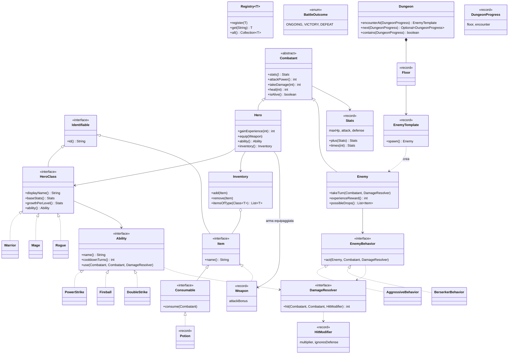
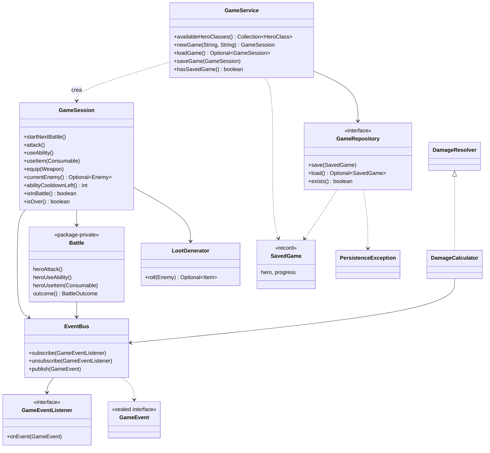
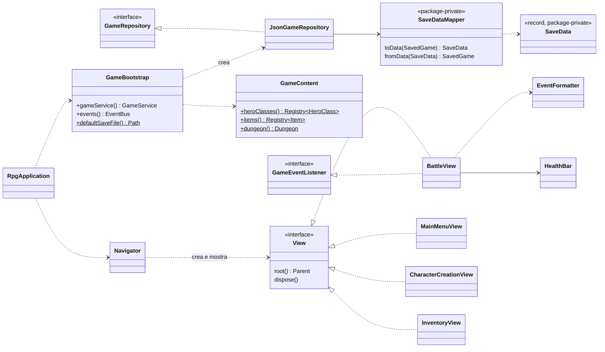

# Classi e interfacce

Tutti i tipi stanno sotto `it.unicam.cs.mpgc.rpg126231`. Per leggibilità i diagrammi sono
divisi per livello; i nomi dei package sono relativi a quello radice.

## Dominio (`model`)

| Tipo | Responsabilità |
|---|---|
| `Identifiable` | Identificativo testuale stabile, usato per registrare e salvare gli elementi. |
| `Registry<T>` | Catalogo di elementi recuperabili per id, nell'ordine di registrazione. |
| `combat.Stats` | Statistiche immutabili (PV massimi, attacco, difesa), sommabili e moltiplicabili. |
| `combat.Combatant` | Stato comune a chi combatte: nome, punti vita, danno subito, cura. |
| `combat.DamageResolver` | Astrazione di "un colpo tra due combattenti": calcola e applica il danno. |
| `combat.HitModifier` | Modificatori di un colpo: moltiplicatore e se ignora la difesa. |
| `combat.BattleOutcome` | Stato di un combattimento: in corso, vittoria, sconfitta. |
| `hero.Hero` | L'eroe: statistiche derivate da classe e livello, esperienza, inventario, arma equipaggiata. |
| `hero.HeroClass` | Caratteristiche di una classe: statistiche iniziali, crescita, abilità. |
| `hero.Warrior`, `hero.Mage`, `hero.Rogue` | Le tre classi della prima release. |
| `ability.Ability` | Abilità speciale (Strategy): nome, ricarica, effetto. |
| `ability.PowerStrike`, `ability.Fireball`, `ability.DoubleStrike` | Colpo doppio; colpo che ignora la difesa; due colpi consecutivi. |
| `enemy.Enemy` | Nemico: statistiche, esperienza data, possibili oggetti; delega la mossa al comportamento. |
| `enemy.EnemyBehavior` | Intelligenza artificiale di un nemico (Strategy). Senza stato, condivisibile. |
| `enemy.AggressiveBehavior`, `enemy.BerserkerBehavior` | Attacco sempre normale; attacco potenziato sotto il 30% dei PV. |
| `enemy.EnemyTemplate` | Descrizione di un tipo di nemico e fabbrica di istanze nuove. |
| `item.Item` | Oggetto dell'inventario. |
| `item.Consumable` | Oggetto che si consuma usandolo su un combattente. |
| `item.Potion` | Pozione curativa. |
| `item.Weapon` | Arma con bonus d'attacco. |
| `item.Inventory` | Elenco ordinato degli oggetti, con filtro per tipo. |
| `dungeon.Dungeon` | Sequenza dei piani: nemico di una posizione, posizione successiva. |
| `dungeon.Floor` | Piano: sequenza dei nemici da affrontare. |
| `dungeon.DungeonProgress` | Posizione: indice del piano e del combattimento. |

## Logica di gioco (`service`)

| Tipo | Responsabilità |
|---|---|
| `GameService` | Operazioni fuori dalla partita: classi disponibili, nuova partita, salvataggio (solo tra i combattimenti), caricamento. |
| `GameSession` | Partita in corso e facciata per l'interfaccia: avvia i combattimenti, inoltra le azioni, assegna esperienza e oggetti, fa avanzare nel dungeon, decide vittoria e sconfitta. |
| `Battle` | Un combattimento: turno dell'eroe seguito da quello del nemico, ricarica dell'abilità, esito. Visibile solo nel package. |
| `DamageCalculator` | Formula del danno, con generatore casuale iniettato; pubblica ogni colpo. |
| `LootGenerator` | Estrazione dell'oggetto lasciato da un nemico sconfitto. |
| `GameRepository` | Archivio della partita salvata (Repository). |
| `SavedGame` | Ciò che si salva: eroe e posizione nel dungeon. |
| `PersistenceException` | Errore di salvataggio o caricamento, indipendente dal supporto usato. |
| `event.EventBus` | Canale degli eventi: chi pubblica non conosce chi ascolta (Observer). |
| `event.GameEventListener` | Ascoltatore degli eventi. |
| `event.GameEvent` | Eventi di gioco come record annidati: `BattleStarted`, `DamageDealt`, `AbilityUsed`, `ItemUsed`, `CombatantDefeated`, `BattleEnded`, `ExperienceGained`, `LeveledUp`, `ItemLooted`, `GameWon`, `GameLost`. |

## Persistenza, assemblaggio e interfaccia

| Tipo | Responsabilità |
|---|---|
| `persistence.JsonGameRepository` | Implementazione JSON di `GameRepository`: scrittura sicura su file, traduzione degli errori. |
| `persistence.SaveDataMapper` | Conversione tra dominio e dati salvati, usando i registri per ricostruire classi e oggetti. |
| `persistence.SaveData` | Forma dei dati nel file: solo tipi semplici e identificativi. |
| `app.GameContent` | Contenuti della prima release: classi, oggetti, nemici, piani. |
| `app.GameBootstrap` | Composition root: crea e collega tutti i componenti. |
| `ui.javafx.RpgApplication` | Punto d'ingresso JavaFX. |
| `ui.javafx.Navigator` | Crea le schermate e le alterna nella finestra, liberando quella precedente. |
| `ui.javafx.View` | Contratto di una schermata: nodo radice e rilascio delle risorse. |
| `ui.javafx.MainMenuView` | Menu principale. |
| `ui.javafx.CharacterCreationView` | Nome e classe dell'eroe; le classi arrivano dal registro. |
| `ui.javafx.BattleView` | Schermata di gioco; si aggiorna ascoltando gli eventi. |
| `ui.javafx.InventoryView` | Inventario ed equipaggiamento delle armi. |
| `ui.javafx.EventFormatter` | Testo dei messaggi per ciascun evento. |
| `ui.javafx.HealthBar` | Barra dei punti vita riutilizzabile. |
| `ui.javafx.Dialogs` | Finestre di errore. |

## Pattern utilizzati

| Pattern | Dove | Perché | Alternativa scartata |
|---|---|---|---|
| **Strategy** | `Ability`, `EnemyBehavior` | Il comportamento è un oggetto intercambiabile: nuove abilità e IA senza modificare `Battle`. | Uno `switch` sul tipo di classe o di nemico, da modificare a ogni aggiunta. |
| **Composizione** | `Hero` → `HeroClass` | `Hero` resta una sola classe, facile da salvare (basta l'id della classe) e da testare. | `Warrior extends Hero`: gerarchia rigida e salvataggio più complesso. |
| **Factory + Registry** | `Registry`, `EnemyTemplate.spawn()`, `GameService.newGame` | Chi crea un eroe o un oggetto non conosce le classi concrete; la GUI mostra le classi registrate. | Un `enum` delle classi, da modificare a ogni aggiunta. |
| **Observer** | `EventBus`, `GameEventListener`, `BattleView` | Dominio e logica non conoscono la GUI; una GUI web si iscriverebbe agli stessi eventi. | La GUI che interroga lo stato dopo ogni azione. |
| **Facade** | `GameSession` | La GUI usa pochi metodi semplici e non può aggirare le regole. | Esporre `Battle` e `Hero` alla GUI. |
| **Repository** | `GameRepository`, `JsonGameRepository` | La logica non dipende dal supporto; il passaggio a un database è una nuova classe. | Scrivere il file direttamente da `GameService`. |
| **Data Transfer Object** | `SaveData` | Il dominio non contiene dettagli del formato di salvataggio. | Serializzare direttamente `Hero`. |
| **Composition root + iniezione delle dipendenze** | `GameBootstrap` | Ogni classe riceve dal costruttore ciò che le serve; nei test si passano versioni finte. | Framework come Spring, sproporzionati per il progetto. |

Il pattern **Command** per le azioni dell'eroe è stato valutato e scartato: l'elenco delle azioni
(attacco, abilità, oggetto) non è tra le estensioni previste, quindi tre metodi sono più
semplici. Se servisse un'azione nuova, per esempio *Difendi*, sarebbe il momento di introdurlo.

## Test

103 test JUnit 5 su dominio, logica e persistenza. Per rendere i risultati prevedibili:

- `RecordingDamageResolver` è un finto `DamageResolver` che applica un danno fisso e registra i
  colpi: permette di verificare cosa fa un'abilità senza dipendere dal caso.
- `DamageCalculator` e `LootGenerator` ricevono un generatore casuale dal costruttore; nei test
  si usa un generatore che restituisce sempre 0.
- `GameServiceTest` usa un repository in memoria; `JsonGameRepositoryTest` usa una cartella
  temporanea.
- `GameContentTest` verifica che ogni oggetto ottenibile dai nemici sia registrato, e quindi
  salvabile.
