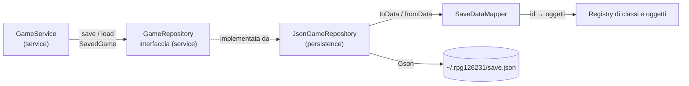

# Dati e persistenza

## Organizzazione dei dati

I dati del gioco si dividono in due categorie.

**Contenuti fissi**, definiti nel codice in `app.GameContent` e mai salvati:

- classi di eroe, registrate in un `Registry<HeroClass>`;
- oggetti (pozioni e armi), registrati in un `Registry<Item>`;
- nemici (`EnemyTemplate`) e struttura del dungeon (`Dungeon` → `Floor` → `EnemyTemplate`).

Ogni classe di eroe e ogni oggetto ha un **identificativo stabile** (`"warrior"`, `"mage"`,
`"small_potion"`, `"sword"`…), definito dall'interfaccia `Identifiable`.

**Stato della partita**, che cambia giocando e va salvato:

- l'eroe: nome, classe, livello, esperienza, punti vita attuali, inventario, arma equipaggiata;
- la posizione nel dungeon: piano e combattimento (`DungeonProgress`).

Non serve salvare altro. Si salva solo tra un combattimento e l'altro, quindi non c'è un
combattimento a metà da ricostruire; i nemici si ricreano da `EnemyTemplate` e le statistiche
dell'eroe si ricalcolano da classe e livello.

## Come è garantita la persistenza



1. **`GameService`** crea un `SavedGame` (eroe più posizione) e lo passa a `GameRepository.save`.
   Rifiuta il salvataggio durante un combattimento o a partita finita.
2. **`GameRepository`** è un'interfaccia del livello `service` (pattern Repository): la logica di
   gioco non sa se sotto c'è un file o un database.
3. **`JsonGameRepository`** usa `SaveDataMapper` per trasformare il `SavedGame` in `SaveData`, un
   insieme di record con solo tipi semplici, e lo scrive con **Gson**.
4. Al caricamento il percorso è inverso: `SaveDataMapper` ricostruisce classe dell'eroe, oggetti
   e arma a partire dagli identificativi, usando i registri.

## Formato del file

Il file si trova in `~/.rpg126231/save.json`, nella cartella dell'utente, quindi funziona allo
stesso modo su Windows, macOS e Linux. Esempio:

```json
{
  "hero": {
    "name": "Merlino",
    "heroClassId": "mage",
    "level": 3,
    "experience": 40,
    "currentHp": 70,
    "inventoryItemIds": ["small_potion", "small_potion", "sword"],
    "equippedWeaponId": "staff"
  },
  "floor": 2,
  "encounter": 1
}
```

Classi e oggetti sono salvati come **identificativi**, non come oggetti completi, per tre motivi:

- il file resta piccolo e leggibile;
- se si cambia il valore di una pozione o le statistiche di una classe, i salvataggi esistenti
  prendono i nuovi valori;
- il dominio non contiene annotazioni o campi pensati per il JSON.

## Robustezza

| Situazione | Comportamento |
|---|---|
| Interruzione durante il salvataggio | Si scrive prima un file temporaneo, poi lo si sostituisce al vecchio con uno spostamento atomico: il salvataggio precedente resta integro. Dove il file system non supporta lo spostamento atomico si ripiega su quello normale, e in caso di errore il file temporaneo viene cancellato. |
| File assente | `load()` restituisce un `Optional` vuoto; nel menu il pulsante "Carica partita" è disattivato. |
| File vuoto, JSON non valido, dati mancanti | `PersistenceException` con un messaggio chiaro; la GUI mostra un errore senza chiudersi. |
| Identificativo sconosciuto (per esempio una classe rimossa) | `PersistenceException`. |
| Oggetto equipaggiato che non è un'arma | `PersistenceException`. |
| Posizione fuori dal dungeon | `PersistenceException`, sollevata da `GameService` al caricamento. |

`PersistenceException` nasconde le eccezioni specifiche (`IOException`, errori di Gson): chi
usa il repository gestisce un solo tipo di errore, qualunque sia il supporto.

## Test

- `JsonGameRepositoryTest` (9 test, in una cartella temporanea): salvataggio e caricamento
  identici, eroe senza arma, sovrascrittura, file corrotto, file vuoto, dati mancanti,
  identificativo sconosciuto, oggetto equipaggiato non valido.
- `GameServiceTest`, con un repository in memoria: ripresa della partita, divieto di salvare
  durante un combattimento o a partita finita, salvataggio fuori dal dungeon.
- `GameContentTest`: ogni oggetto ottenibile dai nemici è registrato, e quindi salvabile.
