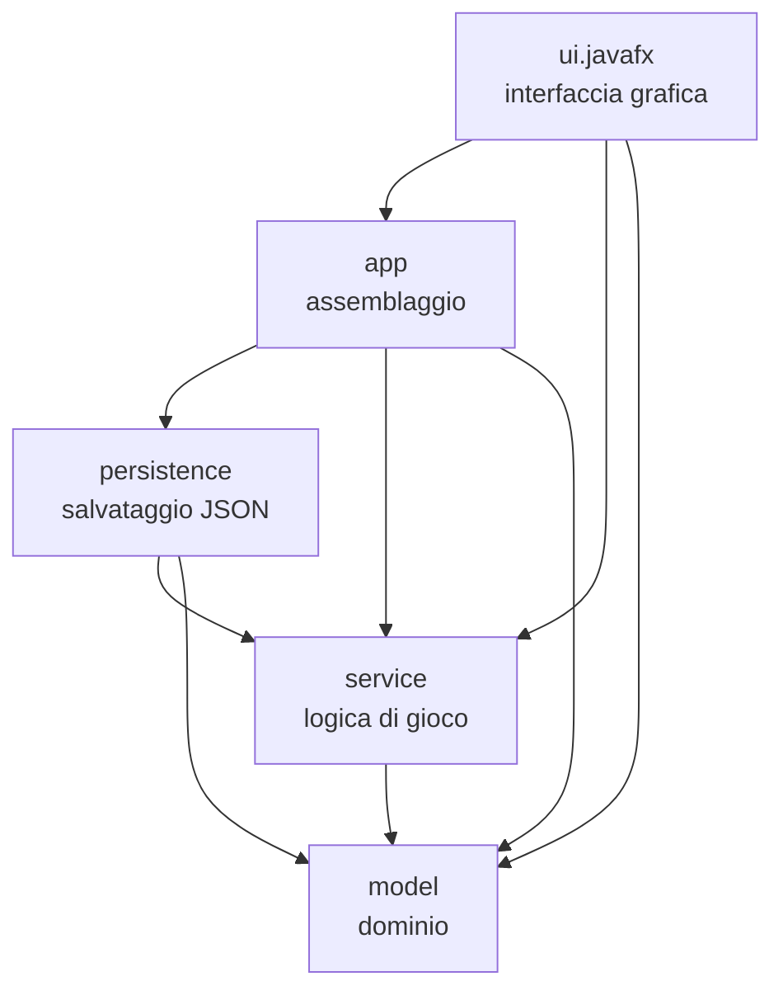

# Responsabilità individuate

## Suddivisione in livelli

Il sistema è diviso in livelli con responsabilità distinte. Le dipendenze vanno in una sola
direzione: il dominio non conosce nessun altro livello, e la logica di gioco non conosce né la
GUI né il formato di salvataggio.

Ogni freccia significa "dipende da". Nessuna freccia parte da `model`, e nessuna va verso
`ui.javafx`.

| Livello | Package | Responsabilità | Non conosce |
|---|---|---|---|
| Dominio | `model` | Entità e regole del gioco: statistiche, eroe, classi, nemici e loro comportamenti, abilità, oggetti, inventario, struttura del dungeon | Tutti gli altri livelli, JavaFX, Gson |
| Logica di gioco | `service` | Svolgimento della partita: turni del combattimento, formula del danno, bottino, esperienza, avanzamento nel dungeon, eventi, operazioni di nuova partita/salva/carica | GUI, formato di salvataggio, JavaFX, Gson |
| Persistenza | `persistence` | Traduzione della partita in JSON e viceversa, lettura e scrittura del file | GUI |
| Interfaccia | `ui.javafx` | Schermate, input del giocatore, visualizzazione degli eventi | Regole di gioco, formato di salvataggio |
| Assemblaggio | `app` | Contenuti della prima release e collegamento di tutti gli oggetti (composition root) | — |

La direzione delle dipendenze è stata verificata durante la revisione finale cercando negli
import di ciascun package.

## Responsabilità principali

Ogni responsabilità del gioco ha un solo "proprietario":

| Responsabilità | Chi se ne occupa | Dove |
|---|---|---|
| Stato di un combattente (punti vita, danno, cura) | `Combatant` | `model.combat` |
| Crescita dell'eroe (livelli, esperienza, arma) | `Hero` | `model.hero` |
| Caratteristiche di una classe di eroe | `HeroClass` e implementazioni | `model.hero` |
| Effetto di un'abilità | `Ability` e implementazioni | `model.ability` |
| Scelta della mossa di un nemico | `EnemyBehavior` e implementazioni | `model.enemy` |
| Creazione dei nemici | `EnemyTemplate` | `model.enemy` |
| Contenuto dell'inventario | `Inventory` | `model.item` |
| Struttura del dungeon e posizione | `Dungeon`, `Floor`, `DungeonProgress` | `model.dungeon` |
| Formula del danno | `DamageCalculator` | `service` |
| Oggetti lasciati dai nemici | `LootGenerator` | `service` |
| Sequenza dei turni e ricarica dell'abilità | `Battle` | `service` |
| Svolgimento della partita e ricompense | `GameSession` | `service` |
| Nuova partita, salvataggio, caricamento | `GameService` | `service` |
| Notifica degli eventi | `EventBus` | `service.event` |
| Conversione dominio ↔ dati salvati | `SaveDataMapper` | `persistence` |
| Lettura e scrittura del file | `JsonGameRepository` | `persistence` |
| Contenuti della prima release | `GameContent` | `app` |
| Collegamento dei componenti | `GameBootstrap` | `app` |
| Cambio di schermata | `Navigator` | `ui.javafx` |
| Testo dei messaggi di gioco | `EventFormatter` | `ui.javafx` |

## Principi seguiti

- **Singola responsabilità (SRP).** Per esempio, la formula del danno sta in `DamageCalculator`
  e non in `Battle`; la conversione dei dati in `SaveDataMapper` e non in `JsonGameRepository`;
  il testo dei messaggi in `EventFormatter` e non in `BattleView`.
- **Aperto/chiuso (OCP).** Classi di eroe, abilità, comportamenti dei nemici, oggetti e nemici
  si aggiungono con nuove classi o nuovi dati, senza modificare il codice che li usa.
- **Sostituzione di Liskov (LSP).** Qualunque `Ability`, `EnemyBehavior` o `GameRepository` può
  sostituire un'altra implementazione; `Hero` ed `Enemy` sono usati come `Combatant` dove serve.
- **Segregazione delle interfacce (ISP).** `Consumable` è separata da `Item`: un'arma non è
  costretta ad avere un metodo `consume`.
- **Inversione delle dipendenze (DIP).** Abilità e comportamenti dipendono da `DamageResolver`;
  `GameService` dipende da `GameRepository`. Le interfacce stanno nel livello che le *usa*,
  le implementazioni in quello che le *fornisce*.

## Accesso controllato

- `Battle` è visibile solo dentro `service`: la GUI non può chiamarla direttamente e saltare
  l'assegnazione di esperienza e oggetti, ma deve passare dalla facciata `GameSession`.
- Le classi del package `persistence` diverse da `JsonGameRepository` non sono pubbliche: il
  formato del file resta un dettaglio interno.
- Le schermate della GUI non sono pubbliche: all'esterno è visibile solo `RpgApplication`.
